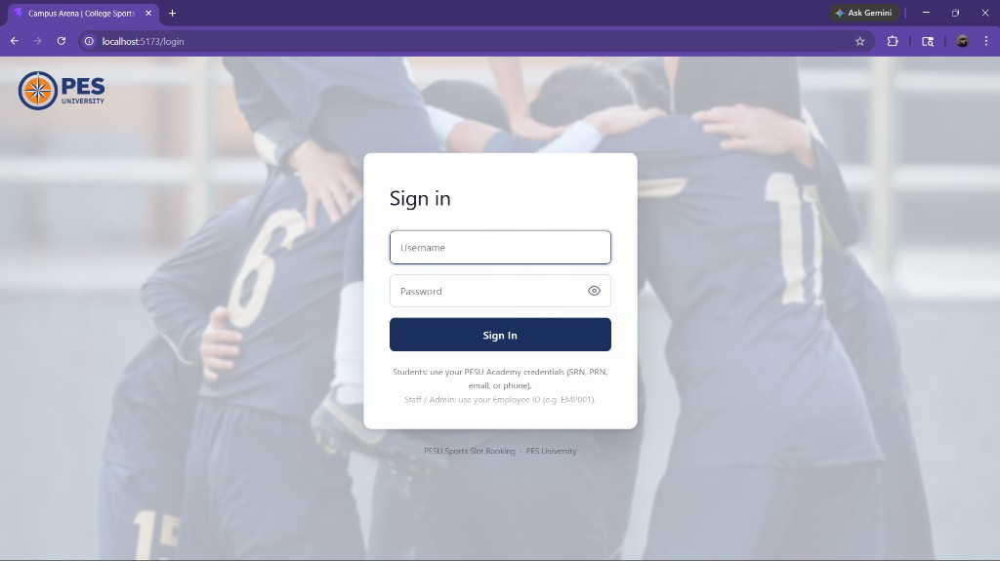
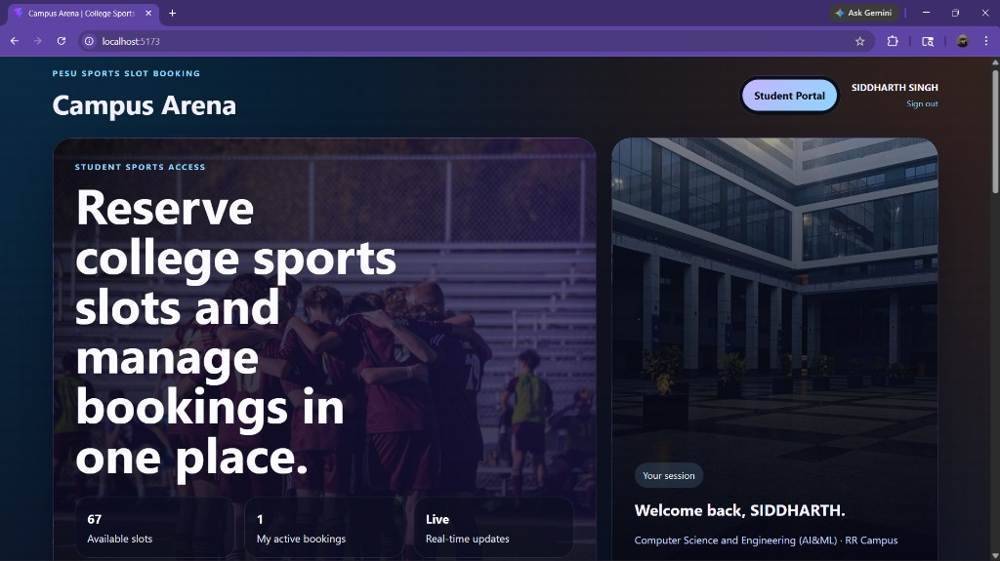
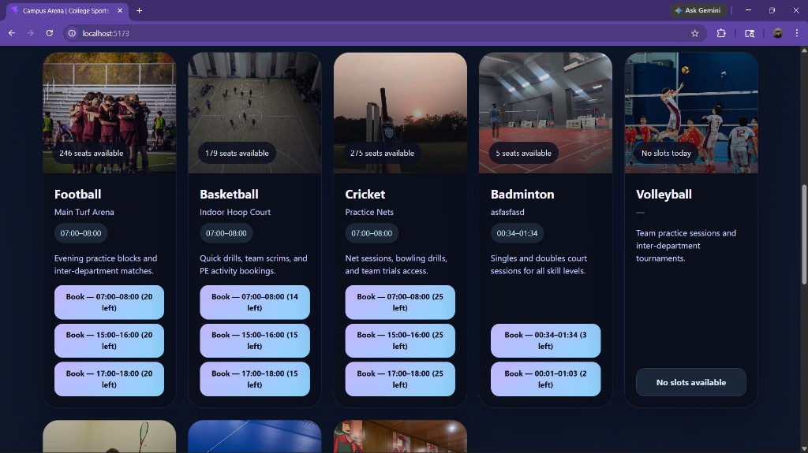
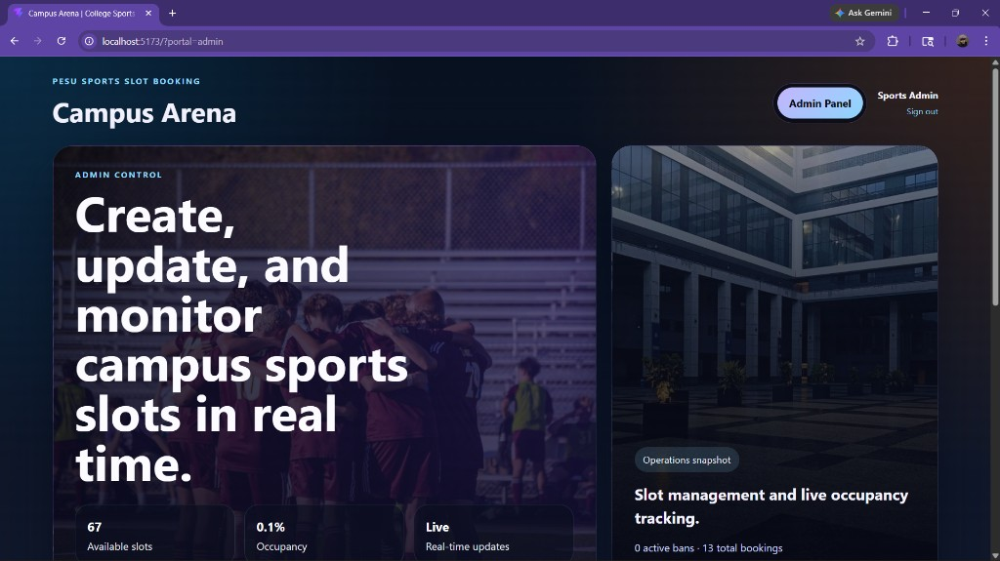
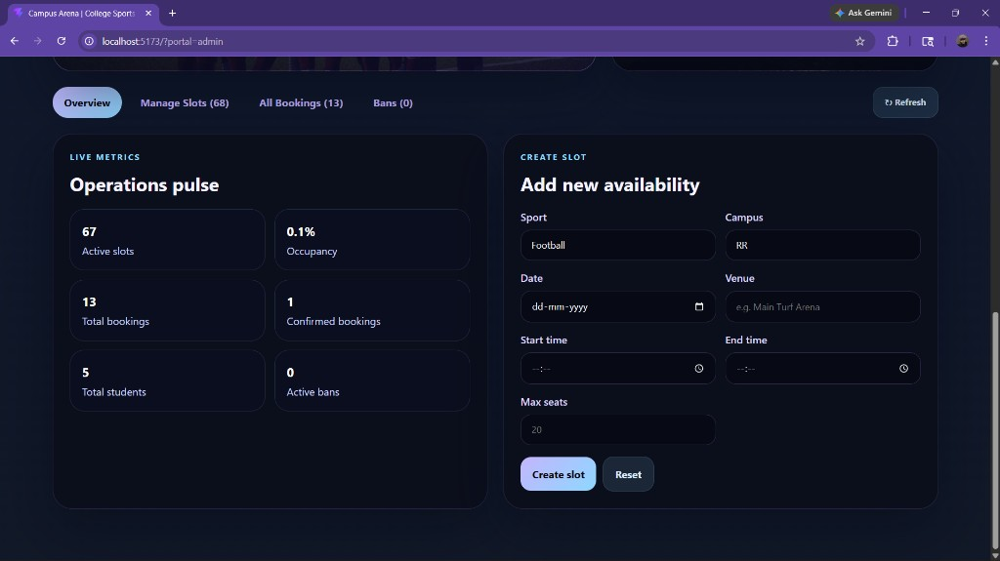

<div align="center">


# PESU Sports Slot Booking System

**A full-stack sports facility booking portal for PES University**  
Book slots for 8 sports across RR and EC campuses — with real-time updates, admin controls, and automatic ban enforcement.

[](https://fastapi.tiangolo.com/)
[](https://react.dev/)
[](https://www.mongodb.com/atlas)
[](https://vitejs.dev/)
[](https://www.python.org/)

</div>

---

## Screenshots

**Login Page**  


**Student Dashboard**  


**Book a Slot**  


**Admin Panel — Overview**  


**Admin Panel — Live Metrics & Create Slot**  


---

## Features

### Student Portal
- **PESUAuth Login** — sign in with SRN, PRN, email, or phone number via the official PESU authentication API
- **Sport Cards** — browse available slots for all 8 sports with live seat counts
- **Campus & Sport Filters** — quickly find slots by RR or EC campus
- **Book a Slot** — instant confirmation with conflict detection (no double-booking, no time clashes)
- **My Bookings** — view and cancel your upcoming bookings (with late-cancel warning)
- **Ban Banner** — clear notification if suspended, with expiry time shown

### Admin Portal
| Tab | Capabilities |
|-----|-------------|
| **Overview** | Live metrics — total slots, occupancy %, confirmed bookings, active bans, registered students; Create Slot form |
| **Manage Slots** | View all slots; inline Edit and permanent Delete per slot |
| **All Bookings** | Full booking history; force-cancel any active booking |
| **Bans** | View all active suspensions; Lift Ban for any student |

### Booking Rules (enforced server-side)
- Auto-confirm — all bookings immediately set to `confirmed`
- **1 booking per sport per day** per student
- **Time-clash prevention** — can't overlap two sports at the same time
- **2-hour cancellation window** — cancellations must be made ≥ 2 hours before slot start
- **Late-cancel ban** — cancelling inside the 2-hour window triggers an automatic **2-day booking ban**
- Banned students are blocked from making new bookings

### Real-Time Updates (WebSocket)
- All connected dashboards refresh instantly on any booking or slot change
- Events: `slot_created`, `slot_updated`, `slot_cancelled`, `booking_created`, `booking_cancelled`
- Frontend reconnects automatically with exponential backoff (up to 10 retries)

### Security & Auth
- JWT access tokens (60 min) + opaque refresh tokens (hashed in DB, 1-day expiry)
- Tokens stored in `sessionStorage` — cleared automatically on tab close
- Axios interceptor queues concurrent requests and auto-refreshes on 401
- Rate limiting on login endpoint via `slowapi`

### Email Notifications (optional)
- Booking confirmation email
- Cancellation email with ban warning if late cancel
- Silently skipped if SMTP is not configured

---

## Tech Stack

| Layer | Technology |
|-------|-----------|
| Backend framework | FastAPI 0.115 + Uvicorn |
| Database | MongoDB Atlas (Motor async driver) |
| Auth | JWT (`python-jose`) + bcrypt (`passlib`) |
| HTTP client | httpx (PESUAuth integration) |
| Rate limiting | slowapi |
| Email | aiosmtplib |
| Real-time | WebSockets (native FastAPI) |
| Schema validation | Pydantic v2 |
| Frontend | React 18 + Vite 5 |
| Routing | React Router v6 |
| HTTP (client) | Axios with interceptor |
| State management | Context API + sessionStorage |
| External auth API | [PESUAuth](https://pesu-auth.onrender.com) |

---

## Project Structure

```
pesu_sports_slot_booking_system/
├── backend/
│   ├── app/
│   │   ├── main.py               # FastAPI app, CORS, WebSocket /ws endpoint
│   │   ├── config.py             # Settings loaded from .env
│   │   ├── database.py           # MongoDB connect/close, get_db dependency
│   │   ├── dependencies.py       # JWT bearer, get_current_user, require_admin
│   │   ├── ws_manager.py         # WebSocket ConnectionManager singleton
│   │   ├── utils.py              # success_response / error_response helpers
│   │   ├── routers/
│   │   │   ├── auth.py           # POST /auth/login, /refresh, /logout, /me
│   │   │   ├── bookings.py       # GET /bookings/available, POST /create, GET /my-bookings, DELETE /{id}
│   │   │   └── admin.py          # Full CRUD for slots, bookings, bans, users
│   │   ├── services/
│   │   │   ├── auth_service.py   # PESUAuth integration, admin login, JWT, sessions
│   │   │   ├── booking_service.py# All booking rules and ban logic
│   │   │   ├── admin_service.py  # Slot/booking management, metrics
│   │   │   └── email_service.py  # aiosmtplib notifications
│   │   ├── schemas/              # Pydantic request/response models
│   │   └── models/               # MongoDB document shapes
│   ├── .env.example              # Template — copy to .env and fill in values
│   ├── requirements.txt
│   ├── seed_data.py              # Seeds all 8 sports × 2 campuses
│   └── setup_db.py               # Creates MongoDB indexes
│
└── frontend/frontend/
    ├── src/
    │   ├── api/
    │   │   ├── client.js         # Axios instance, JWT interceptor, auto-refresh queue
    │   │   ├── auth.js           # login, logout, refreshToken, getMe
    │   │   ├── bookings.js       # getAvailableSlots, createBooking, cancelBooking, getMyBanStatus
    │   │   └── admin.js          # All admin API calls
    │   ├── context/
    │   │   └── AuthContext.jsx   # Session-only auth state (sessionStorage)
    │   ├── hooks/
    │   │   └── useWebSocket.js   # Auto-reconnecting WebSocket hook
    │   ├── components/
    │   │   └── ProtectedRoute.jsx
    │   └── pages/
    │       ├── Login.jsx         # PESU-styled login page
    │       └── Dashboard.jsx     # Full student + admin portal
    ├── public/
    │   ├── pesu-logo.png
    │   └── images/               # Sport hero images (football, basketball, cricket, …)
    └── vite.config.js            # Proxies /api → :8000 and /ws → ws://localhost:8000
```

---

## Prerequisites

| Tool | Minimum Version |
|------|----------------|
| Python | 3.11+ |
| Node.js | 18+ |
| npm | 9+ |
| MongoDB Atlas account | — (free tier works) |

---

## Getting Started

### 1. Clone the repository

```bash
git clone https://github.com/siddhxrthsingh/Slot-booking-system.git
cd Slot-booking-system
```

### 2. Backend Setup

```bash
cd backend

# Create and activate virtual environment
python -m venv venv

# Windows
.\venv\Scripts\activate

# macOS / Linux
source venv/bin/activate

# Install dependencies
pip install -r requirements.txt
```

#### Configure environment variables

```bash
cp .env.example .env
```

Open `.env` and fill in your values:

```env
APP_ENV=development
SECRET_KEY=your-super-secret-key-change-this-in-production
ACCESS_TOKEN_EXPIRE_MINUTES=60
REFRESH_TOKEN_EXPIRE_DAYS=1

MONGO_URI=mongodb+srv://<user>:<password>@cluster.mongodb.net/
MONGO_DB_NAME=slot_booking

PESU_AUTH_URL=https://pesu-auth.onrender.com/authenticate
FRONTEND_ORIGIN=http://localhost:5173

ADMIN_EMPLOYEE_ID=EMP001
ADMIN_PASSWORD=admin123
ADMIN_NAME=Sports Admin
ADMIN_EMAIL=admin@pesu.edu

# Booking policy
CANCEL_WINDOW_HOURS=2
BAN_DURATION_DAYS=2

# Email (optional — leave blank to disable)
# SMTP_HOST=smtp.gmail.com
# SMTP_PORT=587
# SMTP_USER=your@gmail.com
# SMTP_PASSWORD=your-app-password
# EMAIL_FROM=your@gmail.com
```

#### Initialize the database

```bash
# Create MongoDB indexes
python setup_db.py

# Seed sport slots for all 8 sports × RR + EC campuses
python seed_data.py
```

#### Start the backend server

```bash
uvicorn app.main:app --reload --port 8000
```

API docs available at `http://localhost:8000/docs`

---

### 3. Frontend Setup

```bash
cd frontend/frontend

npm install

npm run dev
```

Frontend runs at `http://localhost:5173`  
Vite automatically proxies `/api` → `http://localhost:8000` and `/ws` → `ws://localhost:8000`

---

## Default Credentials

> **Note:** These are default development credentials. Change `ADMIN_EMPLOYEE_ID` and `ADMIN_PASSWORD` in your `.env` before any public deployment.

| Role | Field | Value |
|------|-------|-------|
| Admin | Employee ID | `EMP001` |
| Admin | Password | `admin123` |
| Student | — | Log in via PESU SRN / PRN / email / phone |

---

## Supported Sports

| Sport | RR Campus | EC Campus |
|-------|:---------:|:---------:|
| Football | ✅ | ✅ |
| Basketball | ✅ | ✅ |
| Cricket | ✅ | ✅ |
| Badminton | ✅ | ✅ |
| Volleyball | ✅ | ✅ |
| Squash | ✅ | ✅ |
| Table Tennis | ✅ | ✅ |
| Chess | ✅ | ✅ |

---

## API Overview

| Method | Endpoint | Auth | Description |
|--------|----------|------|-------------|
| `POST` | `/auth/login` | — | Student (PESUAuth) or Admin login |
| `POST` | `/auth/refresh` | Refresh token | Get new access token |
| `POST` | `/auth/logout` | JWT | Invalidate session |
| `GET` | `/auth/me` | JWT | Current user info |
| `GET` | `/bookings/available` | JWT | List available slots (filterable) |
| `POST` | `/bookings/create` | JWT | Create a booking |
| `GET` | `/bookings/my-bookings` | JWT | Student's own bookings |
| `GET` | `/bookings/my-ban` | JWT | Student's current ban status |
| `DELETE` | `/bookings/{id}` | JWT | Cancel a booking |
| `GET` | `/admin/slots` | Admin | All slots |
| `POST` | `/admin/slots` | Admin | Create slot |
| `PUT` | `/admin/slots/{id}` | Admin | Edit slot |
| `DELETE` | `/admin/slots/{id}` | Admin | Delete slot |
| `GET` | `/admin/bookings` | Admin | All bookings |
| `DELETE` | `/admin/bookings/{id}` | Admin | Force-cancel booking |
| `GET` | `/admin/bans` | Admin | Active bans |
| `DELETE` | `/admin/bans/{id}` | Admin | Lift a ban |
| `WS` | `/ws` | — | Real-time event stream |

---

## Known Limitations

- **PESUAuth cold starts** — PESUAuth is hosted on Render's free tier. The first login after a period of inactivity may take ~30 seconds. This is handled with a 35-second timeout in the backend.
- **Swimming / Tennis** — these sports may still exist in the database if you ran an older version of `seed_data.py`. Use the admin **Manage Slots → Delete** button to remove them.
- **Email notifications** — silently skipped unless SMTP credentials are set in `.env`.

---

---

<div align="center">
  Built with <3
</div>
